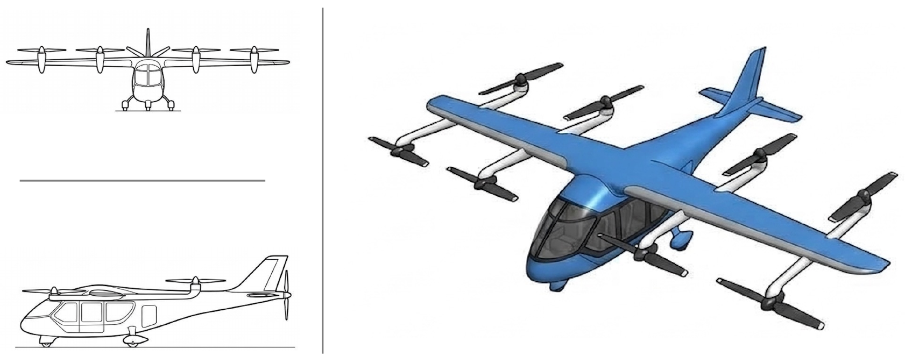
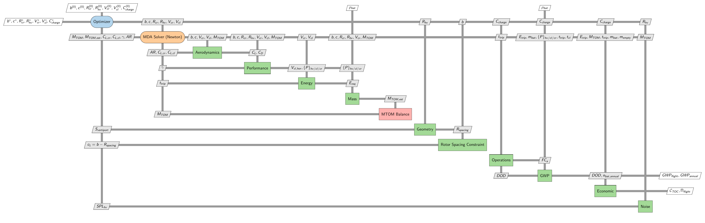

# eVTOL Lift+Cruise Conceptual MDO Model

## Context: Urban Air Mobility

Urban Air Mobility (UAM), as part of the broader Advanced Air Mobility (AAM) ecosystem, envisions a
"safe, sustainable, affordable, and accessible air transportation system for passenger mobility,
goods delivery, and emergency services" within metropolitan areas [[6]](#ref-6). It is enabled by
an emerging class of electric, largely autonomous aircraft intended to move people and cargo over
short-to-medium distances in and around cities, complementing existing ground transport
[[1]](#ref-1). Electric Vertical Take-Off and Landing (eVTOL) aircraft are the most prominent
vehicle concept in this space, combining helicopter-like vertical flight with the efficiency of
fixed-wing cruise.

## What this repository is

This repository is an [OpenMDAO](https://openmdao.org/)-based model for the **Multidisciplinary
Design Optimization (MDO)** [[2]](#ref-2) of a **lift+cruise eVTOL** aircraft. "Lift+cruise" refers to a
configuration that uses a dedicated set of vertical (hover) rotors for take-off and landing, and a
separate horizontal propeller and fixed wing for efficient forward flight.

The goal is a **simple, low-fidelity, conceptual-design-level model** that couples multiple
disciplines — aerodynamics, mass/weight, power and energy, mission performance, noise, operations,
economics, and environmental impact (GWP) — into a single differentiable model that can be
analyzed or optimized with just a few lines of Python. It is meant as a compact, transparent
starting point for exploring UAM/eVTOL design trade-offs and MDO architectures: readers only need
to be comfortable with basic aircraft sizing, performance, and optimization concepts to follow it,
and the code is intentionally kept simple enough to read end-to-end, modify, and extend for your
own experiments (new disciplines, different vehicle configurations, alternative objectives, etc.).

Vehicle sizing and mission assumptions are inspired by NASA's reference UAM concept
vehicles [[3]](#ref-3):



*Figure 1: Simplified illustration of a lift+cruise eVTOL for UAM, based on NASA's reference
vehicles [[3]](#ref-3).*


## XDSM diagram

The figure below shows the model's Extended Design Structure Matrix (XDSM) [[4]](#ref-4), i.e.
which disciplines exist, what data they exchange, and how the optimizer, the internal
mass-convergence loop, and the constraints fit together.



*Figure 2: XDSM of the eVTOL lift+cruise MDO model, showing the optimizer, the coupled
mass-convergence (MDA) loop, and all downstream disciplines.*


### How to read it

- **Optimizer** (top-left): chooses the design variables — wing span/chord, hover/cruise rotor
  radii, cruise/climb speed, and battery charge rate — and receives the objective and constraints
  back.
- **MDA Solver (Newton)**: the aerodynamics, performance, energy, and mass disciplines are
  physically coupled through the aircraft's take-off mass (`MTOM`): mass depends on required power
  and energy, which depend on aerodynamics and speed, which in turn depend on mass. This loop is
  solved to convergence (a small Newton solver) before any downstream discipline is evaluated —
  this is what "MDA" (Multidisciplinary Analysis) means here.
- Once converged, the mass, aerodynamic, and climb-angle results are checked against
  **design constraints** (e.g. maximum take-off mass, lift-coefficient limits, climb-angle
  bounds, rotor spacing, aspect ratio) and fed back to the optimizer.
- **Operations, GWP (environmental impact), Economics, and Noise** sit downstream of the
  converged mass/energy solution and produce the reported key performance indicators (KPIs):
  flight cycles, cost per flight, revenue/profit, and CO2e emissions per flight and per year.
- The default optimization objective is minimizing the estimated take-off mass (`MTOM_est`),
  subject to the constraints described above.

The overall model architecture builds on earlier work by Janning et al. [[5]](#ref-5).

## Repository structure

```
run_analysis_evtol.py     # single-point analysis (fixed design point, prints all results)
run_optimize_evtol.py     # runs the MDO (SLSQP) and prints the optimized design + results
src/
    parameters/            # model_parameters.py: all fixed constants, units, and assumptions
    models/                # low-level physics/engineering equations, grouped by discipline
        aerodynamics/, momentum/, mass/, energy/, time/, battery/, noise/, economic/, gwp/,
        operations/, smooth/ (numerically smooth helper functions, e.g. soft floor/max)
    optimizer/
        eVTOL_group.py       # the OpenMDAO Group that wires all disciplines together
        components/          # one OpenMDAO Component per discipline (wraps the src/models/ math)
xdsm/                    # XDSM diagram source (xdsm.py) and rendered figures (.pdf + .png)
requirements.txt          # Python dependencies
```

Each discipline is implemented twice on purpose: plain math functions in `src/models/` (often
JAX-based, for automatic differentiation), and a thin OpenMDAO wrapper in
`src/optimizer/components/` that exposes them as an OpenMDAO `Component` with inputs, outputs, and
partial derivatives. `src/optimizer/eVTOL_group.py` assembles all components into one `Group` and
sets up the Newton solver used to converge the MTOM loop shown in the XDSM diagram.

Running `python xdsm/xdsm.py` regenerates `xdsm/xdsm_evtol_group.pdf` from the current model
structure; re-run `pdftoppm -png -r 200 xdsm_evtol_group.pdf xdsm_evtol_group -singlefile` (inside
`xdsm/`) afterwards to refresh the PNG used in this README.

## Dependencies and installation

All Python dependencies are listed in [requirements.txt](requirements.txt) (OpenMDAO, NumPy, JAX,
SciPy; `pyxdsm` is only needed if you want to regenerate the XDSM diagram, and additionally
requires a local LaTeX installation such as TeX Live or MacTeX for the PDF build step).

```bash
python -m venv .venv
source .venv/bin/activate        # on Windows: .venv\Scripts\activate
pip install -r requirements.txt
```

## Usage

Run a single-point analysis at a fixed design point (no optimization, just evaluates the model
once and prints all disciplinary results):

```bash
python run_analysis_evtol.py
```

Run the multidisciplinary design optimization (minimizes `MTOM_est` subject to the constraints
shown in the XDSM diagram, using SciPy's SLSQP driver):

```bash
python run_optimize_evtol.py
```

Both scripts print a structured, human-readable report (mass breakdown, aerodynamics,
performance, energy, battery, operations, economics, and environmental impact) to the terminal.
To explore or extend the model, start from `src/parameters/model_parameters.py` (change fixed
assumptions), or add/modify a discipline component in `src/optimizer/components/` and wire it into
`src/optimizer/eVTOL_group.py`.

## References

<a id="ref-1"></a>[1] Raza, W., Renkhoff, J., Ogirimah, O., Bawa, G. K., & Stansbury, R. S. (2025).
*Advanced Air Mobility: Innovations, Applications, Challenges, and Future Potential*. Published
online 20 Jan 2025. [https://doi.org/10.2514/1.D0440](https://doi.org/10.2514/1.D0440)

<a id="ref-2"></a>[2] Martins, J. R. R. A., & Lambe, A. B. (2013). *Multidisciplinary Design
Optimization: A Survey of Architectures*. AIAA Journal.
[https://doi.org/10.2514/1.J051895](https://doi.org/10.2514/1.J051895)

<a id="ref-3"></a>[3] NASA Advanced Air Mobility Reference Vehicles.
[https://www.nasa.gov/reference/uam-refs/](https://www.nasa.gov/reference/uam-refs/)

<a id="ref-4"></a>[4] Lambe, A. B., & Martins, J. R. R. A. (2012). *Extensions to the Design
Structure Matrix for the Description of Multidisciplinary Design, Analysis, and Optimization
Processes*. Structural and Multidisciplinary Optimization.
[https://doi.org/10.1007/s00158-012-0763-y](https://doi.org/10.1007/s00158-012-0763-y)

<a id="ref-5"></a>[5] Janning, J., Armanini, S. F., & Fasel, U. (2024). *Future Pathways for
eVTOLs: A Design Optimization Perspective*.
[arXiv:2412.18078 [eess.SY]](https://doi.org/10.48550/arXiv.2412.18078)

<a id="ref-6"></a>[6] Cohen, A. P., Shaheen, S. A., & Farrar, E. M. (2021). *Urban Air Mobility:
History, Ecosystem, Market Potential, and Challenges*. IEEE Transactions on Intelligent
Transportation Systems, 22(9), 6074–6087.

## Citing this repository

above. If you use this research code, please cite the repository using GitHub's
**Cite this repository** function and the underlying model paper [[5]](#ref-5). A software DOI
can be added after archiving a stable release.

